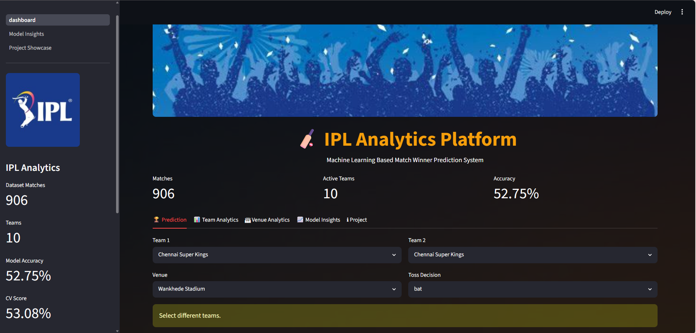
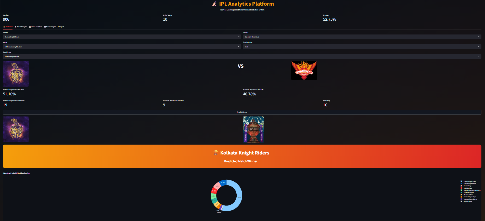
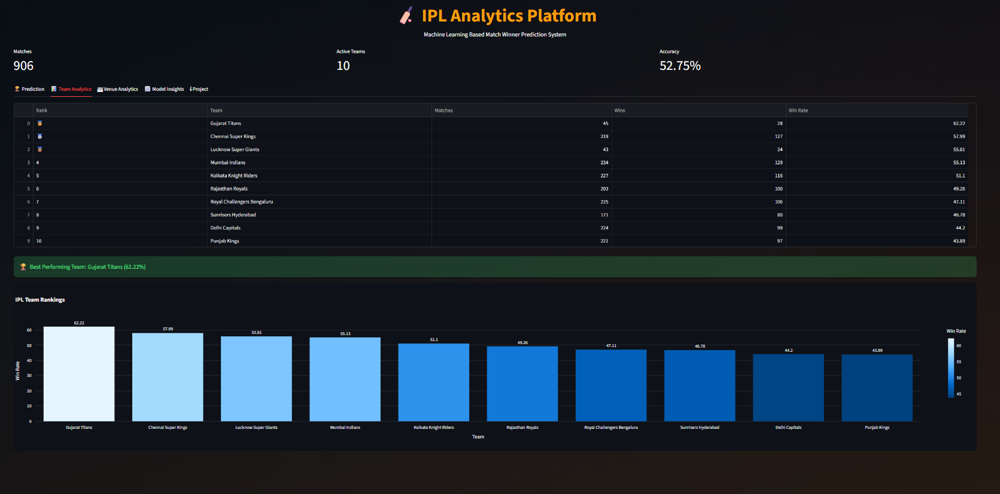
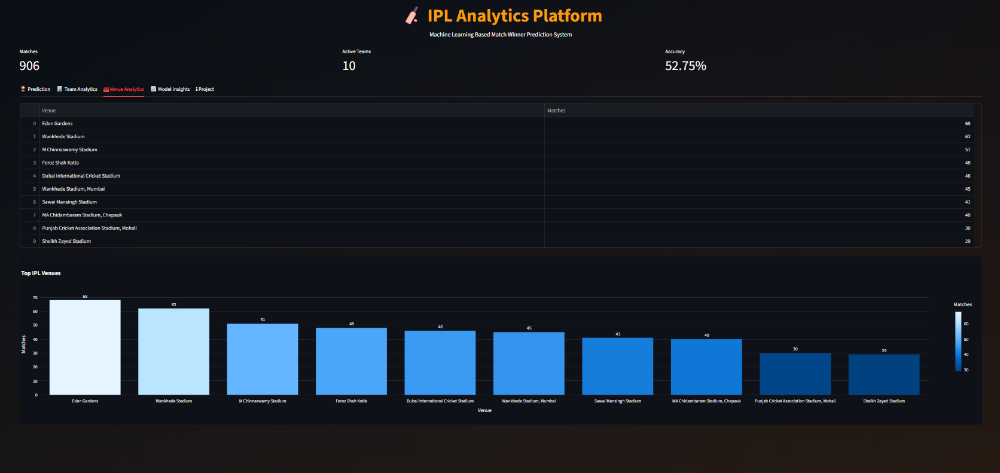
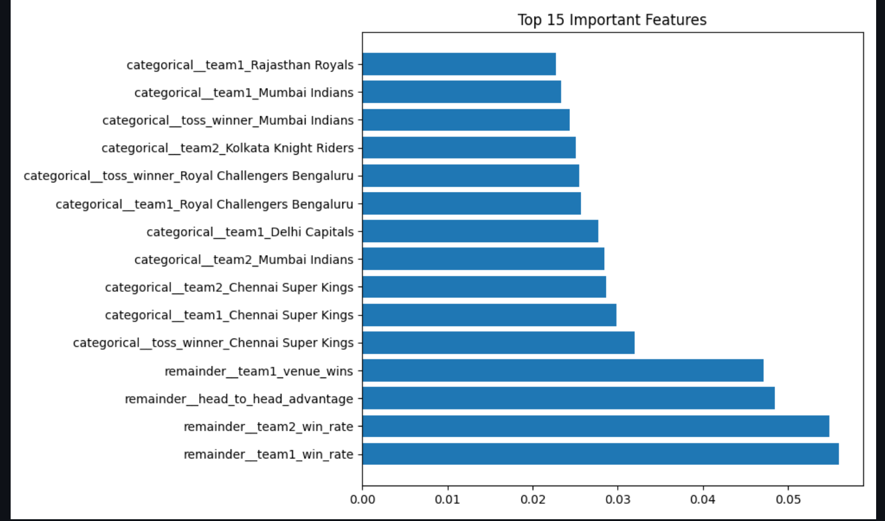
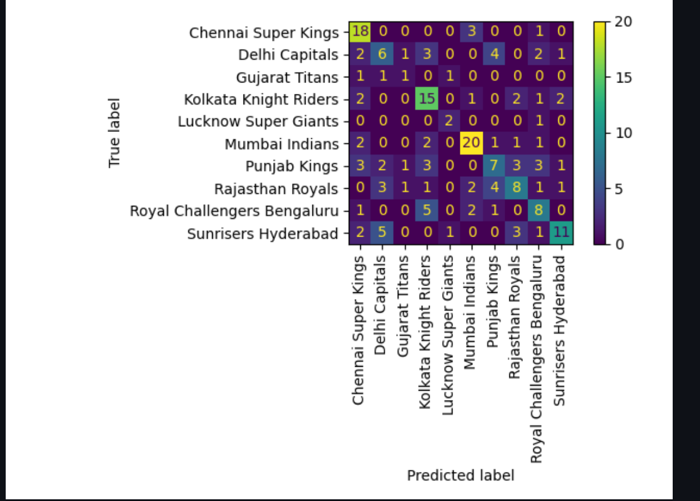

# 🏏 IPL Analytics Platform

A Machine Learning-based IPL Match Winner Prediction platform built using Python, Scikit-Learn, Flask, and Streamlit.

The project predicts the winning team before a match using historical IPL data, engineered features, and a Random Forest Classifier. It also provides an interactive dashboard for analytics and exposes a prediction API for external applications.

---

## 🚀 Features

- Match Winner Prediction
- Interactive Streamlit Dashboard
- Team Analytics
- Venue Analytics
- Feature Importance Visualization
- Confusion Matrix Visualization
- Flask REST API
- Random Forest Machine Learning Model
- Feature Engineering
- Prediction Confidence Score

---

## 🛠 Tech Stack

- Python
- Pandas
- NumPy
- Scikit-Learn
- Streamlit
- Flask
- Plotly
- Joblib

---

## 📂 Project Structure

```text
ipl-analytics/
│
├── api/
├── app/
├── assets/
├── dashboard/
├── data/
├── models/
├── notebooks/
├── reports/
├── screenshots/
├── src/
├── requirements.txt
└── README.md
```

## ⚙️ Installation

Clone the repository

```bash
git clone https://github.com/shreeyayadav10/ipl-analytics-platform.git
```

Go inside the project

```bash
cd ipl-analytics-platform
```

Create a virtual environment

```bash
python -m venv venv
```

Activate it

### Windows

```bash
venv\Scripts\activate
```

Install dependencies

```bash
pip install -r requirements.txt
```

## ▶️ Run the Dashboard

```bash
streamlit run dashboard/dashboard.py
```

---

## ▶️ Run the Flask API

```bash
python api/app.py
```

## 📊 Model Performance

| Metric | Value |
|---------|-------|
| Model | Random Forest |
| Accuracy | 52.75% |
| Cross Validation | 53.85% |

## 📸 Screenshots

### Dashboard



---

### Prediction



---

### Team Analytics



---

### Venue Analytics



---

### Feature Importance



---

### Confusion Matrix



## 🔗 API Example

**POST**

```
http://127.0.0.1:5000/predict
```

Example JSON

```json
{
  "team1":"Chennai Super Kings",
  "team2":"Royal Challengers Bengaluru",
  "toss_winner":"Chennai Super Kings",
  "toss_decision":"bat",
  "venue":"MA Chidambaram Stadium, Chepauk",
  "city":"Chennai",
  "team1_win_rate":0.58,
  "team2_win_rate":0.47,
  "team1_venue_wins":35,
  "head_to_head_advantage":10
}
```

## 🔮 Future Improvements

- Live IPL score integration
- Player-level statistics
- Win probability simulation
- Deep Learning models
- Team comparison dashboard
- Cloud deployment